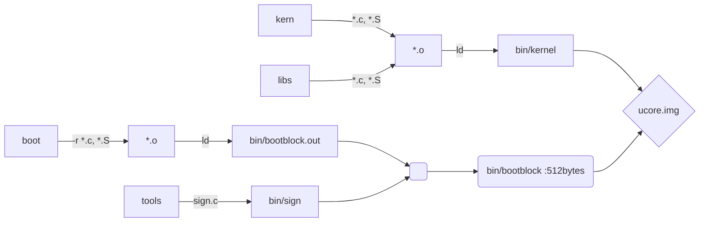

# Lab 1-1

> bootloader 启动 OS

[TOC]


# 知识准备


## x86启动顺序

* register 初始值
  * CS = F000H，EIP = 000FFF0H
* 实际地址
  * 段寄存器CS实际基址 Base = FFFF0000H
  * Base + EIP = FFFFFFF0H --> 这是BIOS的EPROM `Erasable Programmable Read Only Memory` 所在地（只读）
  * 当CS被新值加载，地址转换规则将开始起作用
  * 第一条指令是一个`长跳转指令(这样CS,EIP均会更新)`，跳转到`BIOS`代码中执行
  
* 处于实模式的段

  * 实模式寻址：CS:IP --> FFFF0H (20-bit（1MiB)）
  * 段选择子 `Segment Selector` : CS, DS, SS, ...
  * 偏移量 `Offset` ：EIP

* 从`BIOS`到`Bootloader`

  * `BIOS` 加载存储设备（软盘，硬盘，光盘，USB盘）上的第一个扇区（主引导扇区`MBR(Master Boot Record)`）的512字节到内存的`0x7c00`

  * 跳转到 `0x7c00` 的第一条指令开始执行

* 从`bootloader`到`OS`

  * 使能`enable`保护模式 `protection mode` & 段机制 `segment-level`
  * 从硬盘上读取`kernel` in ELF格式的`ucore kernel`（跟在`MBR`后的扇区）并放到内存中固定位置
  * 跳转到 `ucore OS`的入口点 `entry point` 执行，此时控制权到了`ucore OS`

* x86启动顺序 - 段机制

  * 一种简单直接的映射关系（后来有页机制）
  * 先建立好全局描述符表 `GDT`, 由`bootloader`建立
    * 每一项是一个段描述符
    * 设置各个段寄存器的`index`, 使`index`指向`GDT`对应的项
  * 特定寄存器：系统寄存器 `CRO`
    * Enable protection mode : bootloader / OS 要设置 CR0 的bit 0(PE)
    * Segment-level protection : 在保护模式下是自动使能的 

* 加载 ELF 格式的 `ucore OS kernel`
  * 解析ELF文件格式：
    * ELF header : 
      * uint phoff : Program Header Offset
      * ushort phnum : Program Header Number  
    * Program Header : 
      * uint offset : 起始地址，beginning of the segment in the file
      * uint va : 虚地址，where this segment should be placed at
      * uint memsz : 代码块大小，size of segment in byte


## C函数调用的实现

> x86-32 汇编


## GCC 内联汇编

> inline assembly instructions

### 基本内联汇编


### 扩展内联汇编

#### `Grammar` :

```C
Grammar 1:
asm(assembler template
  :output operands(optional)
  :input operands(optional)
  :clobbers(optional)   --- 约束规则
);

Grammar 2:
asm [volatile] ( Assembler Template
   : Output Operands
   [ : Input Operands
   [ : Clobbers ] ]);

Grammar 3:
__asm__ __volatile__(...);
```

#### `Tips` :

* "asm" 和 "\__asm__" 的含义是完全一样的,如果有多行汇编，则每一行都要加上 "\n\t"。其中的 “\n” 是换行符，"\t” 是 tab 符，在每条命令的 结束加这两个符号，是为了让 gcc 把内联汇编代码翻译成一般的汇编代码时能够保证换行和留有一定的空格。
* 数字前加前缀 “％“，如％1，％2等表示使用寄存器的样板操作数。
* 由于这些样板操作数的前缀使用了”％“，因此，在用到具体的寄存器时就在前面加**两个“％”**，如**%%cr0**，但基本的内联汇编寄存器前只需要加一个%即可

* 示例

  ```C
  #define read_cr0() ({ \
      unsigned int __dummy; \
      __asm__( \
          "movl %%cr0,%0\n\t" \
          :"=r" (__dummy)); \
      __dummy; \
  })
  ```

#### `Output operand list` :

> 1. 输出部分`output operand list`，用以规定对输出变量（目标操作数）如何与寄存器结合的约束（constraint）,输出部分可以有多个约束，**互相以逗号分开**。**每个约束以“＝”开头**，接着用一个字母来表示操作数的类型，然后是关于变量结合的约束。

关于约束

```assembly
:"=r" (__dummy) 
+ --- 表任意寄存器

:"=m" (__dummy)  
+ --- 表表示相应的目标操作数是存放在内存单元__dummy中
```

主要约束字母及其含义

| 字母       | 含义                                             |
| ---------- | ------------------------------------------------ |
| m, v, o    | 内存单元                                         |
| R          | 任何通用寄存器                                   |
| Q          | 寄存器eax, ebx, ecx,edx之一                      |
| I, h       | 直接操作数                                       |
| E, F       | 浮点数                                           |
| G          | 任意                                             |
| a, b, c, d | 寄存器eax/ax/al, ebx/bx/bl, ecx/cx/cl或edx/dx/dl |
| S, D       | 寄存器esi或edi                                   |
| I          | 常数（0～31）                                    |

#### `Input operand list` :

>1. 输入部分与输出部分相似，但没有“＝”。
>2. 如果输入部分一个操作数所要求使用的寄存器，与前面输出部分某个约束所要求的是同一个寄存器，那就把对应操作数的编号（如“1”，“2”等）放在约束条件中。


#### `clobber list` :

> 1. 也称为乱码列表
> 2. 这部分常常以“memory”为约束条件，以表示操作完成后内存中的内容已有改变，如果原来某个寄存器的内容来自内存，那么现在内存中这个单元的内容已经改变。乱码列表通知编译器，有些寄存器或内存因内联汇编块造成乱码，可隐式地破坏了条件寄存器的某些位（字段）。

1. 当输入部分存在，而输出部分不存在时，分号“：“要保留
2. 当“memory”存在时，三个分号都要保留

```C
#define __cli() __asm__ __volatile__("cli": : :"memory")
```


#### example 1

Inline assembly (*.c)

> 对系统寄存器 cr0 进行权限位（相应一个bit）置位,将该位置为1（见`cr0 |= 0x80000000`一行采取了或运算）
>
> 注释 1：
>
> [2] : 将 register CR0 的值赋给 [1] 声明的变量 cr0
>
> [3] : 置位
>
> [4] : 将变量 cr0 的值赋给 CR0 系统寄存器
>
> 注释 2：
>
> volatile : No reordering, no elimination
>
> %0 : the first constraint(约束) following
>
> r : A constraint, GCC is free to use any register ,r代表任意寄存器

```C
[1] uint32_t cr0;//cr0内存变量
[2] asm volatile ("movl %%cr0, %0\n" : "=r"(cr0));
[3] cr0 |= 0x80000000;
[4] asm volatile ("movl %0, %%cr0\n"::"r"(cr0));
```

Generated assembly code (*.S)

> 生成的汇编代码

```assembly
movl %cr0, %ebx
movl %ebx, 12(%esp)
orl  $-2147483648, 12(%esp)
movl 12(%esp), %eax
movl %eax, %cr0
```

#### example 2

Inline assembly

```C
long res,arg1=2,arg2=22,arg3=222,arg4=223;
asm volatile("int $0x80"
            :"=a"(res)
            :"0"(11),"b"(arg1),"c"(arg2),"d"(arg3),"S"(arg4));
```

1. `Output` : res <-- %eax

2. `Input` : 注意输入行 `"0"`也表示eax

   > 顺序：
   >
   > q 指示编译器从eax, ebx, ecx, edx分配寄存器
   >
   > r 指示编译器从eax, ebx, ecx, edx, esi, edi分配寄存器
   >
   > * 数字%n的用法：数字表示的寄存器是按照出现和从左到右的顺序映射到用"r"或"q"请求的寄存器．
   >
   > * 如果要重用"r"或"q"请求的寄存器的话，就可以使用它们。
   > * 此处重用了`%eax`，因此根据上所示顺序, "0"即对应%eax

   1. $11 -> %eax
   2. arg1 -> %ebx
   3. arg2 -> %ecx
   4. arg3 -> %edx
   5. arg4 -> %esi

#### example 3

Inline assembly

```C
   int count=1;
    int value=1;
    int buf[10];
    void main()
    {
        asm(
            "cld nt"
            "rep nt"
            "stosl"
        :
        : "c" (count), "a" (value) , "D" (buf[0])
        : "%ecx","%edi"
        );
    }
```

1. 冒号后的语句依次指明输出`Output`，输入`Input`和被改变的寄存器`clobbers`。
2. cld,rep,stos这几条语句的功能是向buf中写上count个value值。

Assembly

```assembly
    movl count,%ecx
    movl value,%eax
    movl buf,%edi
    #APP
    cld
    rep
    stosl
    #NO_APP
```

#### example 4

> 可以让gcc自己选择合适的寄存器

inline as 

```C
 asm("leal (%1,%1,4),%0"
        : "=r" (x)
        : "0" (x)
    );
```

1. `Onput` : x <-- %eax
2. `Iutput` : x --> %eax
3. 注意顺序

assmebly

```assembly
movl x,%eax
#APP
leal (%eax,%eax,4),%eax
#NO_APP
movl %eax,x
```

- [1] 使用q指示编译器从eax, ebx, ecx, edx分配寄存器。 使用r指示编译器从eax, ebx, ecx, edx, esi, edi分配寄存器。

- [2] 不必把编译器分配的寄存器放入改变的寄存器列表，因为寄存器已经记住了它们。

- [3] "="是标示输出寄存器，必须这样用。

- [4] 数字%n的用法：数字表示的寄存器是按照出现和从左到右的顺序映射到用"r"或"q"请求的寄存器．如果要重用"r"或"q"请求的寄存器的话，就可以使用它们。

- [5] 如果强制使用固定的寄存器的话，如不用%1，而用ebx，则：

  ```
    asm("leal (%%ebx,%%ebx,4),%0"
        : "=r" (x)
        : "0" (x) 
    );
  ```


## x86的中断处理

> 1. x86 中断源
> 2. CPU和OS如何处理中断
> 3. 能够对中断向量表（中断描述符表，IDT）初始化

 

### x86中断处理：确定中断服务例程

* 每个中断/异常与一个中断服务例程`ISR(Interrupt Service Routine)`关联，其关联关系储存在中断描述符表`IDT(Interrupt Descriptor Table)`
* `IDT`的起始地址和大小保存在中断描述符表寄存器`IDTR`中
  * `IDT`需要`OS`建立
  * `IDTR`需要`OS`一个指令告诉`CPU`
* `ucore`建立好两个表：GDT，IDT
  * CPU基于这两个表将某次中断和相应的中断服务例程联系起来
  * 异常/中断 ---> IDT ---> GDT ---> ISR
* 段描述符会设定响应的特权级
  * CS : 低两位描述特权级：00(内核态), 01, 10, 11(用户态)
* 不同特权级的中断切换对堆栈的影响
  * 内核态中断：中断处理仍在内核态
  * 用户态中断：跳转到内核态处理中断（产生特权级变化）

### x86中断处理：从中断服务例程返回

* `iret`完成中断例程返回

  * 弹出`eflags`和`ss/esp`(改变特权级就会改变栈，所以返回时要恢复ss和esp)

  * 特权级变化情况下返回时弹出的内容:

    EIP, CS, EFLAGS, ESP, SS

* `ret` or `retf`函数调用返回 

  * `ret`弹出`EIP`
  * 远程跳转：`retf`弹出`CS`和`EIP`

* 以上都是硬件实现的


### x86的中断处理：系统调用

* 用户程序通过系统调用访问`OS kernel`服务
* 实现
  * 指定中断号
  * 使用 `trap`  (软中断)，Software generated interrupt
  * 或者使用特殊指令`sysenter/sysexit`


# 代码


## 练习 1

> 1. 操作系统镜像文件ucore.img是如何一步一步生成的？(需要比较详细地解释Makefile中每一条相关命令和命令参数的含义，以及说明命令导致的结果)
> 2. 一个被系统认为是符合规范的硬盘主引导扇区的特征是什么？

### 涉及内容

* 外设：串口，并口，CGA，时钟，硬盘
* Bootloader 软件
* ucore OS 软件

### 编译内容

> 基于lab1_result

* 执行

  ```makefile
  make clean
  ```

* 参数`"V="`使得编译执行的详细过程会展现出来

  > 注意这个参数是`Makefile`自定义的不是make的内置参数

  ```makefile
  make V=
  ```

* 


### 环境变量

> 查看`Makefile`内容

#### makefile function 语法

```makefile
$(<function> <arguments>)
or
${<function> <arguments>}
```

* 这里， `<function>` 就是函数名，make支持的函数不多。
*  `<arguments>` 为函数的参数，参数间以逗号 `,` 分隔，而函数名和参数之间以“空格”分隔。函数调用以 `$` 开头，以圆括号或花括号把函数名和参数括起。
* 函数调用以 `$` 开头，以圆括号或花括号把函数名和参数括起。

#### call 函数

* call函数是唯一一个可以用来创建新的参数化的函数。你可以写一个非常复杂的表达式，这个表达式中，你可以定义许多参数，然后你可以call函数来向这个表达式传递参数。其语法是：

  ```makefile
  $(call <expression>,<parm1>,<parm2>,...,<parmn>)
  ```

  当make执行这个函数时， `<expression>` 参数中的变量，如 `$(1)` 、 `$(2)` 等，会被参数 `<parm1>` 、 `<parm2>` 、 `<parm3>` 依次取代。而 `<expression>` 的返回值就是 call 函数的返回值。例如：

  ```makefile
  reverse =  $(1) $(2)
  
  foo = $(call reverse,a,b)
  ```

  那么， `foo` 的值就是 `a b` 。当然，参数的次序是可以自定义的，不一定是顺序的，如：

  ```makefile
  reverse =  $(2) $(1)
  
  foo = $(call reverse,a,b)
  ```

  此时的 `foo` 的值就是 `b a` 。

* 需要注意：在向 call 函数传递参数时要尤其注意**空格**的使用。call 函数在处理参数时，**第2个及其之后的参数中的空格会被保留，因而可能造成一些奇怪的效果**。因而在向call函数提供参数时，最安全的做法是去除所有多余的空格。


### Makefile详解

> 参考blog:[ucore_lab1](https://www.cnblogs.com/wuhualong/p/ucore_lab1_exercise1_report.html)
>
> 未完待续

* **line-117** : 生成`libs`目录下的`obj`变量名

  ```makefile
  $(call add_files_cc,$(call listf_cc,$(LIBDIR)),libs,)
  ```

  1. 调用函数`add_file_cc`

     输入参数：2个，第一个是调用函数`listf_cc`的返回值，第二个是目录`libs`

  2. `listf_cc`函数定义为 line-89 处的

     ```makefile
      [89] listf_cc = $(call listf,$(1),$(CTYPE))
     ```

     listf的参数有2个，第一个是call listf_cc传入的参数，也就是`$(1) = $(LIBDIR) = `，第二个参数为`$(CTYPE)`

  3. 

* **line-136** :

  ```makefile
  $(call add_files_cc,$(call listf_cc,$(KSRCDIR)),kernel,$(KCFLAGS))
  ```


### Q1

> **ucore.img 的生成：**
>
> **需要`kernel`和`bootblock`**

**示意图**

> 基于`Makefile`流程



> 依赖关系，摘选自 blog : [ucore-lab1](https://xr1s.me/2018/05/15/ucore-lab1-report/)


#### 总结 1

1. 编译libs和kern目录下所有的.c和.S文件，生成.o文件，并链接得到bin/kernel文件
2. 编译boot目录下所有的.c和.S文件，生成.o文件，并链接得到bin/bootblock.out文件
3. 编译tools/sign.c文件，得到bin/sign文件
4. 利用bin/sign工具将bin/bootblock.out文件转化为512字节的bin/bootblock文件，并将bin/bootblock的最后两个字节设置为0x55AA
5. 为bin/ucore.img分配5000MB的内存空间，并将bin/bootblock复制到bin/ucore.img的第一个block，紧接着将bin/kernel复制到bin/ucore.img第二个block开始的位置

#### 总结 2

1. 第一条线索是针对每个 .c 文件编译出对应的 .o 文件，然后大家一起链接成 bin/kernel 文件。

2. 第二条线索是对于 boot 部分的编译，几个 boot/ 目录下的文件汇编链接成 obj/bootblock.o 之后 `objecopy` 出 raw binary 文件 obj/bootblock.out （这一段写在 Makefile 里，没有用 `$(V)` 直接用了 `@` 所以不会打印出来）。

3. 最后两步是最骚的，通过编译执行一个预先写好的 tools/sign.c 文件，读取整个 obj/bootblock.out ，判断文件大小是不是小于等于 `510` ，如果不是说明构建失败，退出。如果成功则填充 magic number 0xAA55 ，输出到 bin/bootblock 中（这个也是写在 Makefile 中但是没打印出来）。

4. 最后使用 `dd` 命令通过 `/dev/zero/` （提供空字符）在当前目录下创建空文件 `bin/ucore.img`（会先创建空文件夹`bin`，再创建空文件`ucore.img`，并且大小为`10000 KiB`，将两个编译出的文件 bin/bootblock 和 bin/kernel 逐字节拷贝到其中，发现`bin`文件在`labcodes/lab1`中

   ```
   dd if=/dev/zero of=bin/ucore.img count=10000
   10000+0 records in
   10000+0 records out
   5120000 bytes (5.1 MB) copied, 0.0194264 s, 264 MB/s
   
   dd if=bin/bootblock of=bin/ucore.img conv=notrunc
   1+0 records in
   1+0 records out
   512 bytes (512 B) copied, 0.00135004 s, 379 kB/s
   
   dd if=bin/kernel of=bin/ucore.img seek=1 conv=notrunc
   138+1 records in
   138+1 records out
   70775 bytes (71 kB) copied, 0.00330386 s, 21.4 MB/s
   ```

   1. 对`/dev/zero`的解释

      > 详见wiki : [/dev/zero](https://zh.wikipedia.org/wiki//dev/zero)

      * `/dev/zero`在[类UNIX系统](https://zh.wikipedia.org/wiki/类UNIX系统)中是一个特殊的[设备文件](https://zh.wikipedia.org/wiki/设备文件)。`/dev/zero`在被读取时会提供无限的空字符（[ASCII](https://zh.wikipedia.org/wiki/ASCII) NUL, 0x00）。它的典型用法包括用它提供的字符流来覆盖信息，以及产生一个特定大小的空白文件。[BSD](https://zh.wikipedia.org/wiki/BSD)就是通过[mmap](https://zh.wikipedia.org/w/index.php?title=Mmap&action=edit&redlink=1)把`/dev/zero`映射到虚地址空间实现[共享内存](https://zh.wikipedia.org/wiki/共享内存)的。使用[mmap](https://zh.wikipedia.org/w/index.php?title=Mmap&action=edit&redlink=1)将`/dev/zero`映射到一个虚拟的内存空间，这个操作的效果等同于使用一段匿名的内存（没有和任何文件相关）。

      * 创建一个名为foobar、大小为1 [MiB](https://zh.wikipedia.org/wiki/Mebibyte)的文件，以ASCII码为“0”的字符填充：

        ```makefile
        dd if=/dev/zero of=foobar count=1024 bs=1024
        ```

      * 清空sda1分区的数据：

        ```makefile
        # 请不要执行以下指令，除非你试图清除目标分区上的所有资料!
        dd if=/dev/zero of=/dev/sda1
        ```

      * 与`/dev/null`类似，`/dev/zero`也可以作为一个数据源或数据池，所有写往`/dev/zero`将返回成功，没有其他影响，`/dev/null`也是一样，但是作为数据池更常用。所有对`/dev/zero`的读操作，将返回请求数目的“NUL”字节。

   2. 关于`dd`命令

      > 详见wiki : [dd](https://zh.wikipedia.org/wiki/Dd_(Unix))

      * **dd**是一个[Unix](https://zh.wikipedia.org/wiki/Unix)和[类Unix](https://zh.wikipedia.org/wiki/类Unix系统)[系统](https://zh.wikipedia.org/wiki/操作系统)上的命令，主要功能为转换和复制文件。

      * 用空字节覆盖文件的前512个字节：

        ```makefile
        dd if=/dev/zero of=path/to/file bs=512 count=1 conv=notrunc
        ```

        转换选项`notrunc`意味着不缩减输出文件，也就是说，如果输出文件已经存在，只改变指定的字节，然后退出，并保留输出文件的剩余部分。没有这个选项，`dd`将创建一个512字节长的文件。

      * 在不同的分区中复制磁盘分区到磁盘映像文件中：

        ```makefile
        dd if=/dev/sdb2 of=partition.image bs=4096 conv=noerror
        ```

      * 查询`man dd | less` --> `/seek`

        ```
        45        seek=N skip N obs-sized blocks at start of output
        ```

        `skip=xxx`是在备份时对`if`后面的部分也就是原文件跳过多少块再开始备份;
        `seek=xxx`则是在备份时对`of`后面的部分也就是目标文件跳过多少块再开始写。


### Q2

> **符合规范的硬盘MBR：**
>
> **必须恰好 512 字节，且最后两个字节分别是 0x55 和 0xaa，BIOS 只检查这两个字节。**

* 一个被系统认为是符合规范的硬盘主引导扇区的特征有以下几点：
  \- 磁盘主引导扇区只有512字节
  \- 磁盘最后两个字节为`0x55AA`
  \- 由不超过466字节的启动代码和不超过64字节的硬盘分区表加上两个字节的结束符组成

参考答案

    143 从sign.c的代码来看，一个磁盘主引导扇区只有512字节。且
    144 第510个（倒数第二个）字节是0x55，
    145 第511个（倒数第一个）字节是0xAA。

具体实现

> 见`tools/sign.c`


## 练习 2

> 为了熟悉使用qemu和gdb进行的调试工作，我们进行如下的小练习：
>
> 1. 从CPU加电后执行的第一条指令开始，单步跟踪BIOS的执行。
> 2. 在初始化位置0x7c00设置实地址断点,测试断点正常。
> 3. 从0x7c00开始跟踪代码运行,将单步跟踪反汇编得到的代码与bootasm.S和 bootblock.asm进行比较。
> 4. 自己找一个bootloader或内核中的代码位置，设置断点并进行测试。

### Q1

> 通过改写Makefile文件
>
> ```makefile
> debug: $(UCOREIMG)
> 		$(V)$(TERMINAL) -e "$(QEMU) -S -s -d in_asm -D $(BINDIR)/q.log -parallel stdio -hda $< -serial null"
> 		$(V)sleep 2
> 		$(V)$(TERMINAL) -e "gdb -q -tui -x tools/gdbinit"
> ```
>
> * 在调用qemu时增加`-d in_asm -D q.log`参数，便可以将运行的汇编指令保存在q.log中。
> * 为防止qemu在gdb连接后立即开始执行，删除了tools/gdbinit中的"continue"行。

* 关于`make debug`

  ```makefile
      218 debug: $(UCOREIMG)
      219         $(V)$(QEMU) -S -s -parallel stdio -hda $< -serial null &
      220         $(V)sleep 2
      221         $(V)$(TERMINAL) -e "gdb -q -tui -x tools/gdbinit"
  ```

  在`makefile`中定义了`debug`的操作正是启动QEMU、启动Terminal并在其中运行gdb。

  注意到`gdb`调试行涉及的文件是`tools/gdbinit`

  查看`tools/gdbinit`

  ```shell
  file bin/kernel
  target remote :1234
  break kern_init
  continue
  ```

* 修改

  Makefile

  > 如上所示

  gdbinit

  > 此时还没有到`kernel`，因此需要把文件改成`bootblock`，在`start`处打断点

  ```
  set architecture i8086
  file bin/bootblock
  target remote :1234
  break start
  continue
  ```

* 调试准备

  首先通过`make debug`指令（注意不是`make qemu`！！！）运行出等待调试的qemu虚拟机，然后再打开一个终端或者在`Xshell 7`中打开窗口连接，通过下述命令连接到`qemu`虚拟机：

  ```
  gdb
  target remote 127.0.0.1:1234
  ```

  **即可连接qemu，此时qemu会进入停止状态，听从gdb的命令。**

  另外，我们可能需要qemu在一开始便进入等待模式，则我们不再使用make qemu开始系统的运行，而使用make debug来完成这项工作。这样qemu便不会在gdb尚未连接的时候擅自运行了。

  在`Xshell 7`中连接调试

  

  `Terminal`窗口此时停在`0x0000fff0`的位置，这是`EIP`寄存器的值，而`CS`寄存器的值为`0xf000`. 

  

* 调试过程

  * 初始查看寄存器的值

    发现`EIP`为 0xfff0, `CS`为 0xf000，此时为实模式

    ```assembly
    (gdb) info register
    eax            0x0	0
    ecx            0x0	0
    edx            0x663	1635
    ebx            0x0	0
    esp            0x0	0x0
    ebp            0x0	0x0
    esi            0x0	0
    edi            0x0	0
    eip            0xfff0	0xfff0
    eflags         0x2	[ ]
    cs             0xf000	61440
    ss             0x0	0
    ds             0x0	0
    es             0x0	0
    fs             0x0	0
    gs             0x0	0
    ```

  * 查看响应地址内容

    ```assembly
    (gdb) x /2i 0xffff0
       0xffff0:	ljmp   $0x3630,$0xf000e05b
       0xffff7:	das    
    ```

    x：查看相应地址的内容，i：表示查看指令，2i表示查看两条指令

    CPU加电之后第一条指令果然是跳转指令

  * si 执行几步之后发现全是这条汇编指令，也不知道BIOS是咋想的（

    ```assembly
      0xe08e:	add    %al,(%eax)
       0xe090:	add    %al,(%eax)
       0xe092:	add    %al,(%eax)
       0xe094:	add    %al,(%eax)
       0xe096:	add    %al,(%eax)
       0xe098:	add    %al,(%eax)
       0xe09a:	add    %al,(%eax)
       0xe09c:	add    %al,(%eax)
       0xe09e:	add    %al,(%eax)
       0xe0a0:	add    %al,(%eax)
       0xe0a2:	add    %al,(%eax)
       0xe0a4:	add    %al,(%eax)
       0xe0a6:	add    %al,(%eax)
    ```

  * 在`0x7c00`打上断点

    ```shell
    b *0x7c00
    ```

  * 输入指令`c`就会持续运行到`0x7c00`处停下，此时`EIP`为0x7c00


### Q2

> 在初始化位置0x7c00设置实地址断点,测试断点正常

由于boot loader的入口为start，其地址为0x7c00，因此这和`break *0x7c00`效果是相同的。所以前面在`tools/gdbinit`中已经在`start`打下断点就不必再在`0x7c00`处打断点了


通过比对发现从`0x7c00`开始的汇编代码与`boot/bootasm.S`中的是一致的

反汇编代码（由于是32位环境）编译出来的是`%eax`,而`bootasm.S`中的代码是16位的（实模式），且后者的操作码也是带有位长信息的，如`w(word:2bytes)`或`b(byte)`

### Q3

> Q2已经解决

### Q4

> 无，补充一下`gdb`调试的指令

```
next 单步到程序源代码的下一行，不进入函数。
nexti 单步一条机器指令，不进入函数。
step 单步到下一个不同的源代码行（包括进入函数）。
stepi 单步一条机器指令。
```

**关于代码的反汇编**

有可能gdb无法正确获取当前qemu执行的汇编指令，通过如下配置可以在每次gdb命令行前强制反汇编当前的指令，在gdb命令行或配置文件中添加：

```
define hook-stop
x/i $pc
end
```

即可

