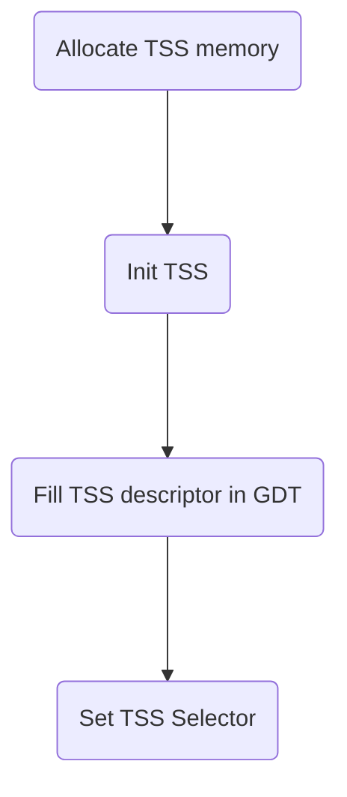

# Lab2-1

> 物理内存管理

[TOC]

# 知识准备


## x86 特权级

> `Privilege levels`

* 特权级

  ```
   &1 Protection Rings
  
                 *
              *    *
           *    *    *
       *    *    *    *
       0    1    2    3
       |    |    |    |
       |    |    |    +----> Applications
       |    +----+---------> Operating System Services(Device Drivers,etc)
       +-------------------> Operating System Kernel
       
   &2 Privilege Levels
       
  Highest                                    Lowest
     |             |             |             |
     +-------------+-------------+-------------+
     
     * uCore and Linux only use ring0 and ring3
  ```

  

* 一些指令（特权指令）只能执行在`ring 0`

* CPU 检查特权级

  * 访问数据段
  * 访问页
  * 进入中断服务例程`ISRs`

  * ...

* 检查失败会产生：`General Protection Fault!`

### 段选择子与段/门描述符

* 当前特权级

  > 两位：00,01,10,11

  段选择子`Segment Selector`

  ```
  +-----------------+---------+
  |                 | RPL/CPL |
  +-----------------+---------+
  15                1         0
  * 处于最低两位`2 bit`
  ```

  * RPL `Requested Privilege Level`
    * 对应数据段，当前需要访问数据段对应的特权级
    * 存在于段寄存器：DS，ES，FS，GS
  * CPL `Current Privilege Level`
    * 对应代码段，当前代码段特权级
    * 存在于段寄存器：CS，SS

  段/门描述符

  ```
  +-----------...---+-----+---...---+
  |                 | DPL |         |
  +-----------...---+-----+---...---+
  31                14    13        0
  ```

  * DPL `Descriptor Privilege Level`
    * 当前需要访问的段（不论是代码段还是数据段），代表访问目标特权级
    * 段描述符，门描述符

* 访问条件

  * 访问门`Gate`时：`CPL <= DPL[ Gate ] & CPL >= DPL[ Segment ]`
    * 针对`Interrupt`, `Trap`, `Exception`,即门情况
    * 代码特权级要比门高，同时要访问处于更高特权级（内核态）
  * 访问段`Segment`时：`MAX( CPL, RPL ) <= DPL[ Segment ]`


### 通过中断切换特权级

> 特权级切换方法还有很多，中断只是其中之一

* 流程（以ring0 ---> ring 3为例)

  模拟栈 ---> 修改：SS( RPL = 3 ), CS( CPL = 3 ) ; 添加 ESP ---> iret指令弹出，然后就可以实现特权级转换


#### TSS

> TSS，一个特殊的段，`Task State Segment`
>
> 任务状态段：包括了不同特权级里的栈信息，ESP，SS

* 特权级转换发生时
  * 地址变化：IDT表
  * 栈变化：TSS机制
* TSS 位于内存中
  * GDT中专门有一项指向`TSS`即`TSS Descriptor`
  * CPU通过GDT中的TSS Descriptor得到TSS的地址然后访问TSS，在特权级转换时候设置新的堆栈`SS:ESP`
* 硬件优化：由于GDT中的TSS Descriptor也是在一个**内存单元中**即某地址处，所以硬件将该地址缓存到一个寄存器中：`Task Register`


#### 建立TSS

> ucore中建立 TSS

* 建立的流程

  ```
  A-->B-->C-->D
  A(Allocate TSS memory)
  B(Init TSS)
  C(Fill TSS descriptor in GDT)
  D(Set TSS Selector) : Task Register initialization
  ```

  



## x86 内存管理单元

> `MMU ( Memory Management Unit )`


### 段机制

> 1. 段寄存器：CS, ES, SS, DS, FS, GS
>
>    > 最高的若干位作为索引`index`来查找`GDT`中的一个项即段描述符`Segment Descriptor`
>
> 2. 段描述符：
>
>    > 1. Base Address 较为重要，如 CS ---GDT--> BA ---> BA + EIP `offset`可以定位下一条指令的位置即**线性地址**，注意如果没有启动保护机制，线性地址==物理地址
>    > 2. Limit 段的长度限制也很重要
>    > 3. 由于 BA 和 Limit 需要访问内存实现（`GDT`在内存中），开销较大，因此硬件优化上把BA，Limit缓存到了各个段寄存器的`Hidden Part`（不可见部分），详见下一子模块）

```
Segment Registers 
            
                     ES     SS     DS     FS     GS           CS
Segment              |      |      |      |      |            |
 Registers           +------+------+------+------+            | 
                            |                                 |
                            +                                 +
                  +---------+---------+             +---------+---------+
                  | Access  | Limit   |             | Access  | Limit   |
Segment           +---------+---------+-----+       +---------+---------+-----+
 Descriptors      |   Base Address    |     |       |   Base Address    |     |
                  +-------------------+-+   |       +-------------------+-+   |
                                        |   |                             |   |
                         (Base Address) |   | (Limit)      (Base Address) |   | (Limit)
             +--------------------------+   +------+                 +----+   +-+
             |                                     |                 |          |
             *                                     *                 *          *
             +--------------------+----------------+-----------------+----------+
             |   Data and Stack   |   Memory I/O   |   Not Present   |   Code   |
             +--------------------+----------------+-----------------+----------+
               0                                                             0xFFFFFFFF
                            Linear Address Space ( or Physical Memory )
```


### MMU-段选择子`segment selector`中的隐藏部分

> 1. 从CS~GS,分为可见区域（如16bit)，还有不可见部分。
>
> 2. 硬件实现
> 3. 加快段的映射过程，提高效率

* Hidden Part 缓存了基址等信息

  ```
       Visible Part               Hidden Part
  +--------------------+--------------------------------+
  |  Segment Selector  | BA, Limit, Access Information  |
  +--------------------+--------------------------------+
                   Segment Registers
  ```

* BA 一直被存放在Hidden Part，直到段选择子发生变化时才更新基址内容（新的段表项的基址值）

### x86 MMU -  建立 GDT

> ucore :: kernel_init 建立映射机制
>
> 区别：lab1建立的对等映射：VA == PA

#### 映射关系表

> 1. 主流CPU都采用页机制为主的页映射关系，但依然会使用段机制的安全访问手段（只是弱化段机制的映射机制了）
> 2. ucore中：从 0xC0000000 `VA` ----映射---> 0x0`PA`
> 3. Lab-2-paging与kernel_init的流程是一致的，改变的只是GDT中段描述符的内容

| 建立GDT      | Lab 1 (bootloader)     | Lab 2 (kernel_init)     | Lab2 (Enable paging)    |
| ------------ | ---------------------- | ----------------------- | ----------------------- |
| 映射实现文件 | bootasm.S              | entry.S                 | pmm.c                   |
| 映射方式     | 对等映射               |                         | 页机制                  |
| Base Address | 0x0                    | -0xC0000000 (negative)  | 0x0                     |
| step 1       | Init GDT as an Array   | Init GDT as an Array    | Init GDT as an Array    |
| step 2       | Init GDT Descriptor    | Init GDT Descriptor     | Init GDT Descriptor     |
| step 3       | Invoking `lgdt`        | Invoking `lgdt`         | Invoking `lgdt`         |
| step 4       | Set bit 0 in CR0       | update DS, ES, SS, etc. | update DS, ES, SS, etc. |
| step 5       | update CS using `ljmp` | update CS using `ljmp`  | update CS using `ljmp`  |


### 页机制


#### 页表项

> 32-bit，BA 都是 20-bit，低12位记录了一些属性，如下所示（部分）

```
R/W bit : 1 if this page is writable.
U/S bit : 1 if this page is accessible in ring 3.
  A bit : 1 if this page has been accessed.

* You may ignore others for now.
* U/S : User or Supervisor
```


#### Enable Paging

* 为了能在保护模式下使能页机制，OS需要置`CR0`寄存器中的bit 31 `PG`，即最高位置1可以


# 代码

## 分析

* 总控代码

  > `pmm_init : Physical Mem Initialization` 
  >
  > `irq_init : 硬中断 `

  ```C
       17 int
       18 kern_init(void) {
       19     extern char edata[], end[];
       20     memset(edata, 0, end - edata);
       21 
       22     cons_init();                // init the console
       23 
       24     const char *message = "(THU.CST) os is loading ...";
       25     cprintf("%s\n\n", message);
       26 
       27     print_kerninfo();
       28 
       29     grade_backtrace();
       30 
       31     pmm_init();                 // init physical memory management
       32 
       33     pic_init();                 // init interrupt controller
       34     idt_init();                 // init interrupt descriptor table
       35 
       36     clock_init();               // init clock interrupt
       37     intr_enable();              // enable irq interrupt
       38 
       39     //LAB1: CAHLLENGE 1 If you try to do it, uncomment lab1_switch_test()
       40     // user/kernel mode switch test
       41     //lab1_switch_test();
       42 
       43     /* do nothing */
       44     while (1);
       45 }
  ```

* 与`Lab 1`的不同

  > 1. 首先，bootloader的工作有增加，在bootloader中，完成了**对物理内存资源的探测工作**（可进一步参阅附录A和附录B），让`ucore kernel`在后续执行中能够基于`bootloader`探测出的物理内存情况进行物理内存管理初始化工作。
  > 2. 其次，bootloader不像lab1那样，直接调用kern_init函数，而是
  >    1. 先调用位于lab2/kern/init/entry.S中的kern_entry函数。kern_entry函数的主要任务是为执行kern_init建立一个**良好的C语言运行环境（设置堆栈）**，而且临时建立了一个段映射关系，为之后建立分页机制的过程做一个准备（细节在3.5小节有进一步阐述）。
  >    2. 完成这些工作后，才调用kern_init函数。

#### 物理内存资源探测

代码`probe_memory  ~  finish_probe`

> 1. OS实现对物理内存资源的探测，基本方法为：**BIOS中断调用** --> 其中BIOS中断调用必须在实模式下进行，所以在bootloader进入保护模式前完成这部分工作相对比较合适。
>
>    > 当 ucore 被启动之后，最重要的事情就是知道还有多少内存可用，一般来说，获取内存大小的方法：
>    >
>    > 
>    >
>    > 1. BIOS 中断调用：但BIOS 中断调用方法是一般只能在实模式下完成
>    >
>    >    1. 通过 BIOS 中断获取内存布局有三种方式，都是基于INT 15h中断，分别为：
>    >       1. 88h
>    >       2. e801h
>    >       3. e820h
>    >    2. 但是 并非在所有情况下这三种方式都能工作。
>    >    3. **在`Linux kernel`里，采用的方法是依次尝试这三种方法。**
>    >    4. 在本实验`ucore::lab2`中，我们通过e820h中断获取内存信息。
>    >
>    >    
>    >
>    > 2. 直接探测：而直接探测方法必须在保护模式下完成
>    >
>    > 
>
> 2. 我们通过调用`INT 15h BIOS Interrupt`，递增di的值（20的倍数），让BIOS帮我们查找出一个一个的内存布局entry，并放入到一个保存地址范围描述符结构的缓冲区中，供后续的ucore进一步进行物理内存管理。这个缓冲区结构定义在memlayout.h中：
>
>    ```C
>    struct e820map {
>                      int nr_map;
>                      struct {
>                                        long long addr;
>                                        long long size;
>                                        long type;
>                      } map[E820MAX];
>    };
>    ```
>
> 3. 物理内存探测是在bootasm.S中实现的
>
> 4. 代码正常执行完毕后：
>
>    在0x8000地址处保存了从BIOS中获得的内存分布信息，此信息按照struct e820map的设置来进行填充。这部分信息将在bootloader启动ucore后，由ucore的page_init函数来根据struct e820map的memmap（定义了起始地址为0x8000）来完成对整个机器中的物理内存的总体管理。
>
>    ```C
>    probe_memory:
>    //对0x8000处的32位单元清零,即给位于0x8000处的
>    //struct e820map的成员变量nr_map清零
>               movl $0, 0x8000
>                      xorl %ebx, %ebx
>    //表示设置调用INT 15h BIOS中断后，BIOS返回的映射地址描述符的起始地址
>                      movw $0x8004, %di
>    start_probe:
>                      movl $0xE820, %eax // INT 15的中断调用参数
>    //设置地址范围描述符的大小为20字节，其大小等于struct e820map的成员变量map的大小
>                      movl $20, %ecx
>    //设置edx为534D4150h (即4个ASCII字符“SMAP”)，这是一个约定
>                      movl $SMAP, %edx
>                                    
>    *** 调用int 0x15中断，要求BIOS返回一个`用地址范围描述符`表示的内存段信息 ***
>                      int $0x15
>    //如果eflags的CF位为0，则表示还有内存段需要探测
>                      jnc cont
>    //探测有问题，结束探测
>                      movw $12345, 0x8000
>                      jmp finish_probe
>    cont:
>    //设置下一个BIOS返回的映射地址描述符的起始地址
>                      addw $20, %di
>    //递增struct e820map的成员变量nr_map
>                      incl 0x8000
>    //如果INT0x15返回的ebx为零，表示探测结束，否则继续探测
>                      cmpl $0, %ebx
>                      jnz start_probe
>    finish_probe:
>    ```


#### 以页为单位管理物理内存


* 页`按照4 KB对齐`数据结构

  > 每个物理页可以用一个 Page数据结构来表示：
  >
  > 1. `Page`定义在`kern/mm/memlayout.h`中,每一个**物理页!!!**的属性用结构`Page`表示
  > 2. 注意是物理页
  > 3. 以页为单位的物理内存分配管理的实现在`kern/default_pmm.c`和`kern/default_pmm.h`。

  ```C
       94 /* *
       95  * struct Page - Page descriptor structures. Each Page describes one
       96  * physical page. In kern/mm/pmm.h, you can find lots of useful functions
       97  * that convert Page to other data types, such as phyical address.
       98  * */
       99 struct Page {
      100     int ref;// page frame's reference counter
      101     uint32_t flags;// array of flags that describe the status of the page frame
      102     unsigned int property;// the num of free block, used in first fit pm manager
      103     list_entry_t page_link;// free list link
      104 };
  ```

  * 在`lab2/libs/list.h`中定义了`list_entry_t`，即双向链表

    ```C
     ---  9  * Simple doubly linked list implementation.
         10  *
         11  * Some of the internal functions ("__xxx") are useful when manipulating
         12  * whole lists rather than single entries, as sometimes we already know
         13  * the next/prev entries and we can generate better code by using them
     --- 14  * directly rather than using the generic single-entry routines.
            
         17 struct list_entry {
         18     struct list_entry *prev, *next;
         19 };
         20 
         21 typedef struct list_entry list_entry_t;
    ```

  * 在初始情况下，也许这个物理内存的空闲物理页都是连续的，这样就形成了一个大的连续内存空闲块。但随着物理页的分配与释放，这个大的连续内存空闲块会分裂为一系列地址不连续的多个小连续内存空闲块，且每个连续内存空闲块内部的物理页是连续的。那么为了有效地管理这些小连续内存空闲块。所有的连续内存空闲块可用一个双向链表管理起来，便于分配和释放，为此定义了一个`free_area_t`数据结构，包含了一个`list_entry`结构的双向链表指针和记录当前空闲页的个数的无符号整型变量`nr_free`。其中的链表指针指向了空闲的物理页。

    ```C
        121 /* free_area_t - maintains a doubly linked list to record free (unused) pages */
        122 typedef struct {
        123     list_entry_t free_list;         // the list header
        124     unsigned int nr_free;           // # of free pages in this free list
        125 } free_area_t;
    ```

    

##### 具体实现

> 1. 管理页级物理内存空间所需的`Page`结构的内存空间从哪里开始，占多大空间？
> 2. 空闲内存空间的起始地址在哪里？

* 对于这两个问题，我们首先根据bootloader给出的内存布局信息找出最大的物理内存地址`maxpa`（定义在`kern/mm/pmm.c :: page_init`函数中的局部变量）

  ```C
      188 /* pmm_init - initialize the physical memory management */
      189 static void
      190 page_init(void) {
      191     struct e820map *memmap = (struct e820map *)(0x8000 + KERNBASE);
      192     uint64_t maxpa = 0;
  ```

  由于x86的起始物理内存地址为0，所以可以得知需要管理的物理页个数为

  ```C
  npage = maxpa / PGSIZE
    ** `mm/mmu.h` : #define PGSIZE 4096
  ```

  这样，我们就可以预估出**管理页级物理内存空间所需的Page结构的内存空间所需的内存大小**为：

  ```C
  sizeof(struct Page) * npage
  ```

  由于`bootloader`加载`ucore`的结束地址，之后的地址空间用来处理为物理空间（用全局指针变量`end`记录，在`kern/init/init.c :: page_init`）以上的空间没有被使用

  ```C
       18 kern_init(void) {
       19     extern char edata[], end[];
       20     memset(edata, 0, end - edata);
  ```

  所以我们可以把`end`按页大小为边界取整后，作为管理页级物理内存空间所需的Page结构的内存空间，记为：

  ```C
  pages = (struct Page *)ROUNDUP((void *)end, PGSIZE);
  ```

  为了简化起见

  ```
  turning point : pages + sizeof(struct Page) * npage
  
  占用：
  	[0 , end] : (1)kernel code
  	[end ,  tp] : (2)Physical page table
  空闲：
  	[tp,edge] 
  ```

  1. 从地址0到地址`pages+ sizeof(struct Page) * npage`结束的物理内存空间设定为`已占用物理内存空间`（起始0~640KB的空间是空闲的）

  2. 地址pages+ sizeof(struct Page) * npage以上的空间为`空闲物理内存空间`，这时的空闲空间起始地址为

     ```C
     uintptr_t freemem = PADDR( (uintptr_t)pages + sizeof(struct Page) * npage );
     ```

  为此我们需要把这两部分空间给标识出来。首先，对于所有**物理空间**，通过如下语句即可实现占用标记：

  ```C
  for (i = 0; i < npage; i ++) {
  		SetPageReserved(pages + i);
  }
    ** `mm/memlayout.h` 
    ** #define SetPageReserved(page)       set_bit(PG_reserved, &((page)->flags))
  ```

  然后，根据探测到的空闲物理空间，通过如下语句即可实现空闲标记：

  ```C
  //获得空闲空间的起始地址begin和结束地址end
  ……
  init_memmap(pa2page(begin), (end - begin) / PGSIZE);
  ```

  其实`SetPageReserved`只需把物理地址对应的Page结构中的flags标志设置为`PG_reserved` ，表示这些页已经被使用了，将来不能被用于分配。而init_memmap函数则是把空闲物理页对应的Page结构中的flags和引用计数ref清零，并加到free_area.free_list指向的双向列表中，为将来的空闲页管理做好初始化准备工作。

  关于内存分配的操作系统原理方面的知识有很多，但在本实验中只实现了**最简单的内存页分配算法**。相应的实现在`default_pmm.c`中的`default_alloc_pages`函数和`default_free_pages`函数，相关实现很简单，这里就不具体分析了，直接看源码，应该很好理解。

  其实实验二在**内存分配和释放方面**最主要的作用是建立了一个**物理内存页管理器框架**，这实际上是一个**函数指针列表**，定义如下：

  ```C
  struct pmm_manager {
              const char *name; //物理内存页管理器的名字
              void (*init)(void); //初始化内存管理器
              void (*init_memmap)(struct Page *base, size_t n); //初始化管理空闲内存页的数据结构
              struct Page *(*alloc_pages)(size_t n); //分配n个物理内存页
              void (*free_pages)(struct Page *base, size_t n); //释放n个物理内存页
              size_t (*nr_free_pages)(void); //返回当前剩余的空闲页数
              void (*check)(void); //用于检测分配/释放实现是否正确的辅助函数
  };
  ```

  重点是实现init_memmap/ alloc_pages/ free_pages这三个函数。

##### 结果

> 当完成物理内存页管理初始化工作后，计算机系统的内存布局如下图所示：


#### 分页机制实现

> 如下图在保护模式中，x86 体系结构将内存地址分成三种：逻辑地址（也称虚地址）、线性地址和物理地址。
>
> ```
> Logical Address ----Segment--> Linear Address ----Page--> Physical Address
> * Segmented storage only plays a transitional role
> ```
>
> 1. 逻辑地址即是程序指令中使用的地址
> 2. 物理地址是实际访问内存的地址。
> 3. 逻辑地址`Logical Address`通过段式`Segment`管理的地址映射可以得到线性地址`Linear Address`
> 4. 线性地址`Linear Address`通过页式`Page`管理的地址映射得到物理地址`Physical Address`。


* 在 ucore 中段式管理只起到了一个过渡作用，它将逻辑地址不加转换直接映射成线性地址，所以我们在下面的讨论中可以对这两个地址不加区分（**目前的 OS 实现也是不加区分的**）

* ucore 的页式管理通过一个二级的页表实现。
  * 一级页表的起始物理地址存放在 cr3 寄存器`PDBR : page directory base register`中，这个地址必须是一个页对齐的地址，也就是低 12 位必须为 0（由于每页是`4 KiB`）。目前，ucore 用 `boot_cr3`（mm/pmm.c）记录这个值。
  * 如下图所示，页式管理将线性地址分成三部分（图中的 Linear Address 的 Directory 部分、 Table 部分和 Offset 部分）。


#### ucore地址映射四阶段

##### 最终映射关系

> 在lab2中，为了建立正确的地址映射关系，ld在链接阶段生成了ucore OS执行代码的虚拟地址，而bootloader与ucore OS协同工作，通过在运行时对地址映射的一系列“腾挪转移”，从计算机加电，启动段式管理机制，启动段页式管理机制，在段页式管理机制下运行这整个过程中，虚地址到物理地址的映射产生了多次变化，实现了最终的段页式映射关系：

```C
 virtual addr = linear addr = physical addr + 0xC0000000
```

##### 具体实现 : 4 steps

###### Step 1

> `boot/bootasm.S::start` ---> `kern/init/entry.S::kern_entry :: kern_entry`

**第一个阶段**是bootloader阶段，即从bootloader的start函数（在boot/bootasm.S中）

```C
13 # start address should be 0:7c00, in real mode, the beginning address of the running bootloader
     14 .globl start
     15 start:
     16 .code16                                             # Assemble for 16-bit mode
     17     cli                                             # Disable interrupts
     18     cld                                             # String operations increment
     ...
```

到执行ucore kernel的`kern_entry`函数之前

```C
      6 .text
      7 .globl kern_entry
      8 kern_entry:
      9     # reload temperate gdt (second time) to remap all physical memory
     10     # virtual_addr 0~4G=linear_addr&physical_addr -KERNBASE~4G-KERNBASE 
     11     lgdt REALLOC(__gdtdesc)
     12     movl $KERNEL_DS, %eax
```

其虚拟地址，线性地址以及物理地址之间的映射关系与lab1的一样，即：

```C
 lab2 stage 1： virt addr = linear addr = phy addr
```


###### Step 2

> `kern/init/entry.S :: kern_entry` ---> `kern/mm/pmm.c :: enable_paging`

**第二个阶段**从从kern_\entry函数开始，到执行enable_page函数（在kern/mm/pmm.c中）之前再次更新了段映射，还没有启动页映射机制。由于gcc编译出的虚拟起始地址从0xC0100000开始，ucore被bootloader放置在从物理地址0x100000处开始的物理内存中。所以当kern_entry函数完成新的段映射关系后，且ucore在没有建立好页映射机制前，CPU按照ucore中的虚拟地址执行，能够被分段机制映射到正确的物理地址上，确保ucore运行正确。这时的虚拟地址，线性地址以及物理地址之间的映射关系为：

```C
 lab2 stage 2： virt addr - 0xC0000000 = linear addr = phy addr
```

注意此时CPU在寻址时还是只采用了分段机制。最后后并使能分页映射机制（请查看lab2/kern/mm/pmm.c中的enable_paging函数），一旦执行完enable_paging函数中的加载`cr0`指令（即让CPU使能分页机制），则接下来的访问是基于段页式的映射关系了。


###### Step 3

> `kern/mm/pmm.c :: enable_paging` ---> `kern/mm/pmm.c :: gdt_init`

**第三个阶段**从`enable_paging`函数开始，到执行`gdt_init`函数（在kern/mm/pmm.c中）之前，启动了页映射机制，但没有第三次更新段映射。这时的虚拟地址，线性地址以及物理地址之间的映射关系比较微妙：

```C
 lab2 stage 3:  virt addr - 0xC0000000 = linear addr  = phy addr + 0xC0000000 # 物理地址在0~4MB之外的三者映射关系
                virt addr - 0xC0000000 = linear addr  = phy addr # 物理地址在0~4MB之内的三者映射关系
```

请注意`pmm_init`函数中的一条语句：

```C
 boot_pgdir[0] = boot_pgdir[PDX(KERNBASE)];
```

就是用来建立物理地址在`0~4MB`之内的三个地址间的临时映射关系`virt addr - 0xC0000000 = linear addr = phy addr`。


###### Step 4

**第四个阶段**从`gdt_init`函数开始，第三次更新了段映射，形成了新的段页式映射机制，并且**取消了临时映射关系**，即执行语句`boot_pgdir [0] = 0;`把boot_pgdir[0]的第一个页目录表项（0~4MB）清零来取消临时的页映射关系。这时形成了我们期望的虚拟地址，线性地址以及物理地址之间的映射关系：

```C
 lab2 stage 4： virt addr = linear addr = phy addr + 0xC0000000
```


#### 建立虚拟页-物理页帧地址映射关系

**建立二级页表**

1. 80368的采用了`二级页表`来建立线性地址与物理地址之间的映射关系。

2. 在二级页表结构中，页目录表占4KB空间，可通过alloc_page函数获得一个空闲物理页作为页目录表`Page Directory Table，PDT`。

3. 整个页目录表和页表所占空间大小取决与二级页表要管理和映射的物理页数。

   > 假定当前物理内存0~16MB，每物理页（也称Page Frame）大小为4KB，则有4096个物理页，也就意味这有4个页目录项和4096个页表项需要设置。
   >
   > 一个页目录项`Page Directory Entry，PDE`和一个页表项`Page Table Entry，PTE`占`4B`，即`32-bit == 4 Bytes`。**! ! ! 即使是4个页目录项也需要一个完整的页目录表（需要对齐）! ! !**占`4KB`。而4096个页表项需要16KB（即4096*4B）的空间，也就是4个物理页，16KB的空间。所以**对16MB物理页建立一一映射的16MB虚拟页**，需要**5个物理页**，即20KB的空间来形成二级页表。

4. 没错，PDE 是页目录表项。而 PTE是页表表项。

   为何一个 PDE、PTE都要单独拿出来说？还记得不，不管是PDE还是PTE，其中的高 20 bit 是用来保存索引号的，而低 12 bit，你只知道保存了属性，如果你还没有去百度 or 谷歌，你肯定不知道这 12 bit 保存了什么。

   无论怎样，先来看看 PDE 和 PTE 的结构。

   PDE 结构

   ```
   |<------ 31~12------>|<------ 11~0 --------->| 比特
                        |b a 9 8 7 6 5 4 3 2 1 0| 
   |--------------------|-|-|-|-|-|-|-|-|-|-|-|-| 占位
   |<-------index------>| AVL |G|P|0|A|P|P|U|R|P| 属性
                                |S|   |C|W|/|/|
                                      |D|T|S|W|
   ```

   PTE 结构

   ```
   |<------ 31~12------>|<------ 11~0 --------->| 比特
                        |b a 9 8 7 6 5 4 3 2 1 0|
   |--------------------|-|-|-|-|-|-|-|-|-|-|-|-| 占位
   |<-------index------>| AVL |G|P|D|A|P|P|U|R|P| 属性
                                |A|   |C|W|/|/|
                                |T|   |D|T|S|W|
   ```

   从上面的结构，发现 PDE 和 PTE 的结构基本上差不多，但是有个别比如第 7 位就不一样。

   属性含义

   > P：有效位。0 表示当前表项无效。
   > R/W: 0 表示只读。1表示可读写。
   > U/S: 0 表示只能0、1、2特权级可访问。3 表示只有特权级程序可访问
   > A: 0 表示该页未被访问，1表示已被访问。
   > D: 脏位。0表示该页未写过，1表示该页被写过。
   > PS: 只存在于页目录表。0表示这是4KB页，指向一个页表。1表示这是4MB大页，直接指向物理页。
   > PWT、PCD、G：暂不讲解


## Task 0

> **练习0：填写已有实验**
>
> 本实验依赖实验1。请把你做的实验1的代码填入本实验中代码中有“LAB1”的注释相应部分。提示：可采用diff和patch工具进行半自动的合并（merge），也可用一些图形化的比较/merge工具来手动合并，比如meld，eclipse中的diff/merge工具，understand中的diff/merge工具等。

### meld tools

* 在`search your computer and online sources`栏处搜索`meld`

* 添加`lab1`和`lab2`两个目录即可比较

* 点击进具体的文件比较，绿色处为不同区域，点击箭头即可将`lab1`中的代码粘贴到`lab2`中

  

* 右侧进度条中的绿色区域点击即可跳转到比对区域

### diff tools

* Grammar

  ```shell
  diff [OPTION]… FILES
  diff options dir1 dir2
  ```

  options : 

  * `-q or --brief` : 仅显示有无差异，不显示详细信息


## Task 1

> **练习1：实现 first-fit 连续物理内存分配算法（需要编程）**
>
> 在实现`first fit`内存分配算法的回收函数时，要考虑地址连续的空闲块之间的合并操作。提示 : 在建立空闲页块链表时，需要按照空闲页块起始地址来排序，形成一个有序的链表。可能会修改default_pmm.c中的default_init，default_init_memmap，default_alloc_pages， default_free_pages等相关函数。请仔细查看和理解default_pmm.c中的注释。
>
> 请在实验报告中简要说明你的设计实现过程。请回答如下问题：
>
> - 你的first fit算法是否有进一步的改进空间


